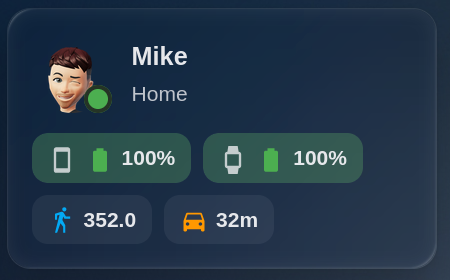

# Person Status Card

A custom Home Assistant Lovelace card that displays personal location status, animated battery indicators (with charging status and phone/watch icons), step counts, and travel time routes.



[](https://github.com/hacs/default)
[](https://github.com/mra282/person-status-card/releases)
[](LICENSE)
[](https://buymeacoffee.com/mra282)

---

## Features

- **Dynamic Location & Zone Tracking**  
  Displays customized zone names (Home, Work, Away, etc.) with color-coded status indicators.

- **Enhanced Battery Monitoring**
  - Supports separate percentage and charging-state sensors (e.g. `sensor.mikes_phone_battery_state`)
  - Distinguishes between Phone (`mdi:cellphone`) and Watch (`mdi:watch-variant`) devices
  - Shows dynamic battery level icons and low-battery visual warnings

- **Animated Charging State**  
  Displays an active charging bolt icon and continuous background shimmer pulse when plugged in.

- **Fitness & Navigation**  
  Shows formatted step counts (e.g. `8.5k`) and dynamically formats travel duration (e.g. `35m` or `1h 10m`).

- **Interactive UI**  
  Click the card to open the native Home Assistant `more-info` dialog for the targeted `person` entity.

- **Visual Card Editor**  
  Full UI configuration support with schema-based field controls.

---

## Installation

### Manual Installation

1. Download `person-status-card.js` from the repository:  
   https://github.com/mra282/ha-person-status-card

2. Copy the file into your Home Assistant directory:
   ```
   /config/www/person-status-card.js
   ```

3. Add the resource in Home Assistant:
   - Go to **Settings → Dashboards → ⋮ (top right) → Resources**
   - Click **Add Resource**
   - **URL**: `/local/person-status-card.js`
   - **Resource Type**: `JavaScript Module`

4. Refresh your browser cache (Ctrl/Cmd + Shift + R).

---

## Configuration

### Visual Editor

Add the card via the Lovelace UI by selecting **Person Status Card** from the card picker.

### YAML Example

```yaml
type: custom:person-status-card
person_entity: person.mike
name: Mike
home_zone: home
work_zone: work
phone_battery: sensor.mikes_phone_battery
phone_battery_state: sensor.mikes_phone_battery_state
watch_battery: sensor.mikes_watch_battery
watch_battery_state: sensor.mikes_watch_battery_state
steps_entity: sensor.mikes_step_count
commute_to_work: sensor.commute_to_work
commute_to_home: sensor.commute_to_home
```

### Configuration Options

| Option                | Type   | Default          | Description                                                                 |
|-----------------------|--------|------------------|-----------------------------------------------------------------------------|
| `person_entity`       | string | **Required**     | Target `person.` entity ID                                                  |
| `name`                | string | `friendly_name`  | Custom display name override                                                |
| `image`               | string | `entity_picture` | Custom avatar image URL override                                            |
| `home_zone`           | string | `home`           | Entity state string identifying the home zone                               |
| `work_zone`           | string | `work`           | Entity state string identifying the work zone                               |
| `phone_battery`       | string | Optional         | Sensor for phone battery level (0–100%)                                     |
| `phone_battery_state` | string | Optional         | Sensor for phone charging state (e.g. `charging`, `plugged`)                |
| `watch_battery`       | string | Optional         | Sensor for watch battery level (0–100%)                                     |
| `watch_battery_state` | string | Optional         | Sensor for watch charging state (e.g. `charging`, `plugged`)                |
| `steps_entity`        | string | Optional         | Sensor reporting step counts                                                |
| `commute_to_work`     | string | Optional         | Travel-time sensor used when the person is at `home`                        |
| `commute_to_home`     | string | Optional         | Travel-time sensor used when the person is outside `home`                   |

---

## Support

If you find this card helpful, consider supporting the developer:

[](https://buymeacoffee.com/mra282)

## License

This project is licensed under the MIT License - see the [LICENSE](LICENSE) file for details.